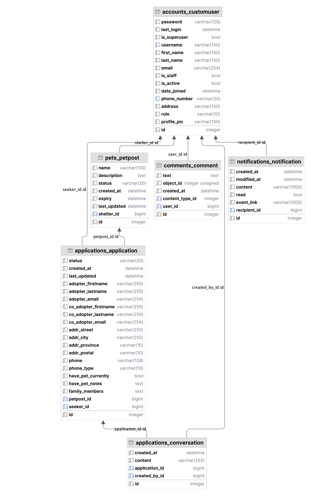

# Setup

```bash
chmod +x startup.sh
chmod +x run.sh

./startup.sh
./run.sh
```

# Model Design



# API Endpoints

## `Accounts Endpoints`

1. **create user**
  - **Endpoint**:  `POST /accounts/`
  - **Description**: Creates a new user account. Requires a username, password, and role in the request body. If the role is `shelter`, then an address is also required.
  - **Request Body Example**:
     ```json
     { 
     "username": "seeker1", 
     "password": "seeker1", 
     "role": "seeker" 
     }
     ```
     ```json
        {
        "username": "shelter1",
        "password": "shelter1",
        "role": "shelter",
        "address": "123 Main St, City, State, Zip"
        }
     ```
2. **User Authentication**
   - **Endpoint**:  `POST /accounts/auth/`
   - **Description**: Authenticates a user. Requires a username and password in the request body.
   - **Request Body Example**:
       ```json
       { "username": "seeker1", "password": "seeker1" }
       ```
       ```json
       { "username": "shelter1", "password": "shelter1" }
       ```
3. **Get user**
   - **Endpoint**:  `GET /accounts/{user_id}`
   - **Description**: Retrieves a specific user by their ID.

4. **Update user**
   - **Endpoint**:  `PUT /accounts/{user_id}`
   - **Description**: Updates a specific user by their ID. All user data must be provided in the request body.
   - **Request Body Example**:
     ```json
     {
       "username": "seeker1",
       "password": "seeker1",
       "role": "seeker",
       "first_name": "John",
       "last_name": "Doe",
       "address": "123 Main St, City, State, Zip"
     }
     ```
5. **Partial update user**
    - **Endpoint**:  `PATCH /accounts/{user_id}`
    - **Description**: Partially updates a specific user by their ID. Only the provided fields in the request body will be updated.
    - **Request Body Example**:
        ```json
        {
        "first_name": "John",
        "last_name": "Doe"
        }
        ```

6. **Delete user**
    - **Endpoint**:  `DELETE /accounts/{user_id}`
    - **Description**: Deletes a specific user by their ID.

7. **list users (shelters only)**
    - **Endpoint**:  `GET /accounts/list/`
    - **Description**: Retrieves a list of all users. (only valid for ?role=shelter)


## `Pets Endpoints`
1. **List All Pet Posts**
   - **Endpoint**: `GET /pets/`
   - **Description**: Retrieves a list of all pet posts. Can include query parameters for filtering, sorting, and pagination.

2. **Create a New Pet Post**
   - **Endpoint**: `POST /pets/`
   - **Description**: Allows the creation of a new pet post. Requires data for the pet post in the request body.

3. **Retrieve a Specific Pet Post**
   - **Endpoint**: `GET /pets/{id}/`
   - **Description**: Retrieves a specific pet post by its ID.

4. **Update a Specific Pet Post**
   - **Endpoint**: `PUT /pets/{id}/`
   - **Description**: Fully updates a specific pet post. All pet post data must be provided in the request body.

5. **Partial Update a Specific Pet Post**
   - **Endpoint**: `PATCH /pets/{id}/`
   - **Description**: Partially updates a specific pet post. Only the provided fields in the request body will be updated.

6. **Delete a Specific Pet Post**
   - **Endpoint**: `DELETE /pets/{id}/`
   - **Description**: Deletes a specific pet post by its ID.

7. **List Pet Posts by a Specific Filter**
   - **Example Endpoint**: `GET /pets/?status=available`
   - **Description**: Lists pet posts filtered by a specific query. For example, filtering by `status`. This can be extended to other filters like `size`, `gender`, etc.

8. **List Pet Posts with Sorting**
   - **Example Endpoint**: `GET /pets/?sort=name`
   - **Description**: Lists pet posts with sorting based on specified fields such as `name` or `age`.


## `Comments Endpoints`

### Shelter User Comments

1. **List Comments for a Shelter User**
   - **Endpoint**: `GET /shelter-comments/<int:user_id>/`
   - **Description**: Retrieves a list of all comments for a specific shelter user. This endpoint is accessible to any authenticated user.
   - **Permissions**: Authenticated users can view comments.
   - **Example Response**:
     ```json
     [
       {
         "id": 1,
         "text": "Great shelter with caring staff!",
         "user": 2,
         "created_at": "2023-11-14T10:00:00.000Z"
       },
       {
         "id": 2,
         "text": "Highly recommend this place for pet adoption.",
         "user": 3,
         "created_at": "2023-11-13T15:30:00.000Z"
       }
     ]
     ```

2. **Create a Comment for a Shelter User**
   - **Endpoint**: `POST /shelter-comments/<int:user_id>/create/`
   - **Description**: Allows an authenticated user to create a comment on a specific shelter user's profile. The comment text should be included in the request body.
   - **Permissions**: Only authenticated users can create comments.
   - **Request Body Example**:
     ```json
     {
       "text": "This shelter has been wonderful in helping us find a new pet."
     }
     ```
   - **Success Response**:
     ```json
     {
       "id": 3,
       "text": "This shelter has been wonderful in helping us find a new pet.",
       "user": 4,
       "created_at": "2023-11-15T12:00:00.000Z"
     }
     ```


## `Applications Endpoints`

-   `/applications/seeker/` 
    - `GET` Retrieve list of application for the login pet seeker 
        - **Example Response**
            ```json
                {    
                  "count": 3,
                  "next": null,
                  "previous": null,
                  "results": [
                      {
                          "id": 5,
                          "seeker": 8,
                          "petpost": 4,
                          "status": "pending",
                          "last_updated": "2023-11-14T20:16:58.349515-05:00",
                          "created_at": "2023-11-10T16:49:45.324047-05:00"
                      },
                      {
                          "id": 6,
                          "seeker": 8,
                          "petpost": 2,
                          "status": "pending",
                          "last_updated": "2023-11-12T14:44:54.192166-05:00",
                          "created_at": "2023-11-12T00:41:27.110517-05:00"
                      },
                      {
                          "id": 7,
                          "seeker": 8,
                          "petpost": 5,
                          "status": "withdrawn",
                          "last_updated": "2023-11-12T14:44:13.948556-05:00",
                          "created_at": "2023-11-12T00:42:12.010093-05:00"
                      }
                  ]
              }
            ```
        - **Additional Notes**
-   `/applications/seeker/<application_id>`
-   `/applications/shelter/`
-   `/applications/shelter/<application_id>`
-   `/applications/pet/<pet_id>/`
-   `/<application_id>/conversations/`

## `Notifications Endpoints`

-   `/notifications`
-   `/notifications/<notification_id>`
